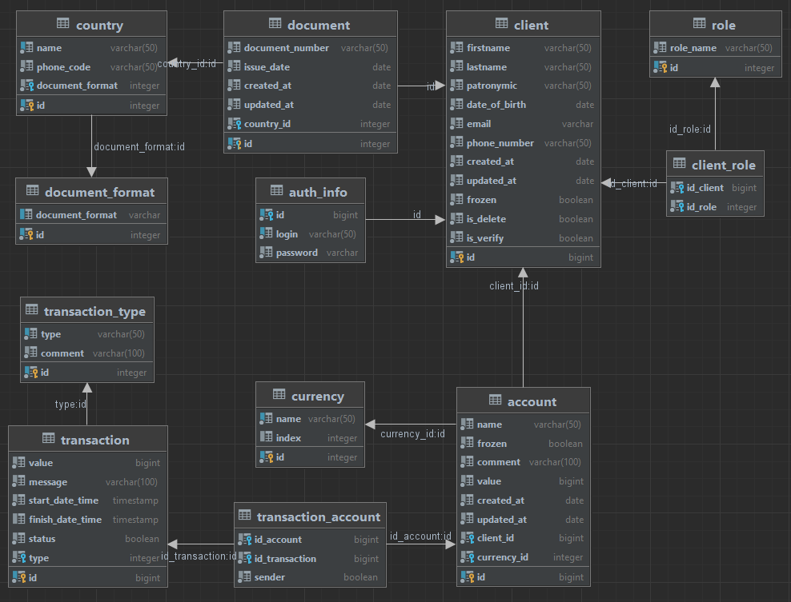

[postgres code](postgre) <- это ссылка на файл с бд, если чо :)

# Инициализация бд 

Что бы это сделать вам не обязательно клонировать всю репу. Тут два варианта: 
1. Создаете бд postgre у себя на машине, подключаетесь через идею или pgAdmin (кому что), копируете туда код и выполняете его.
2. Клонируете проект, создаете бд под каким вам нравится названием, в идее подключаетесь, копируете код в консоль и выполняете его.

После выполнения кода смотрите на таблицу, если есть предложения по изменению меняйте, кидайте pull request -> будем обсуждать.

Для pull request необходимо: 
1. Внести корректировки в код бд в своей локальной консоли
2. Не изменить таблицы а перевыполнить весь скрипт через дроп синтаксис
3. Посмотреть связи, проверить, ничего ли вы не упустили 
4. Если код выполняется то скопировать СТРОКИ КОТОРЫЕ БЫЛИ ДОБАВЛЕНЫ/УДАЛЕНЫ в файл postgre 
5. кинуть PR на всю команду или заинтересованных

